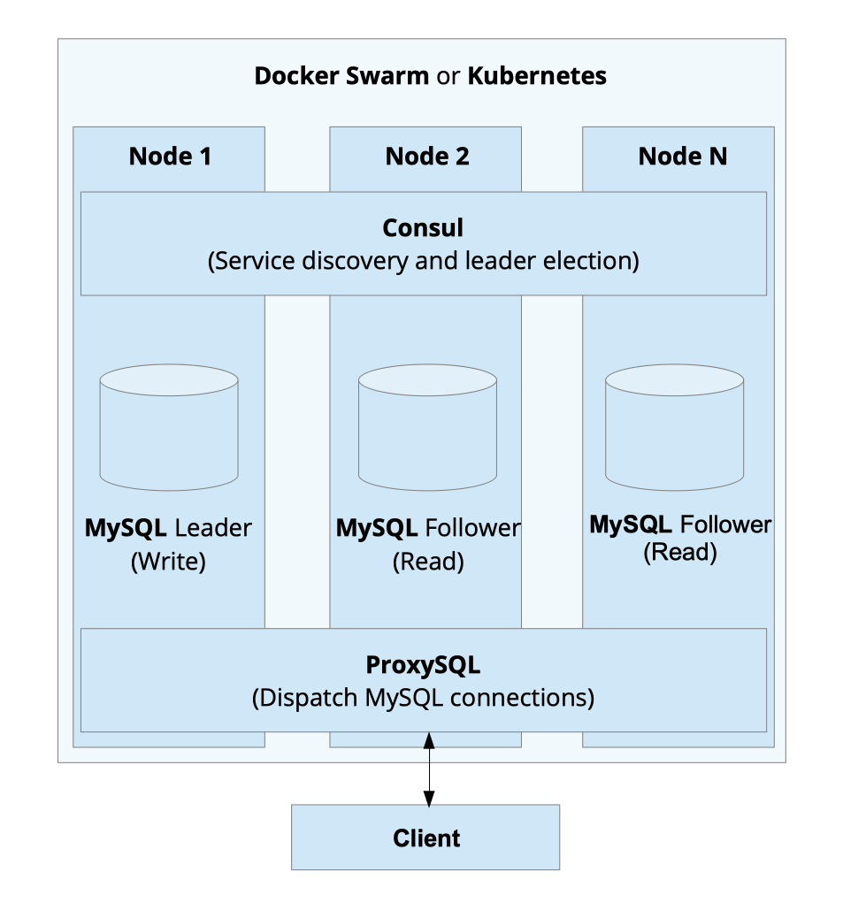

# MySQL-HA-Cloud - A Highly-Available Self-Hosted MySQL Cloud Container Orchestrator

 
This project provides a container image for a highly-available MySQL installation that can be deployed to Kubernetes or Docker Swarm environments.
 
 

**Project state:** Beta version available

## Architecture

The `mysql-ha-cloud` container image contains a [MySQL 8.0 Server](https://dev.mysql.com/doc/relnotes/mysql/8.0/en/), [Consul](https://www.hashicorp.com/products/consul) for the service discovery, health checks of the nodes, and the MySQL replication leader election. [ProxySQL](https://proxysql.com/) provides the entry point for the client; the software forwards the connections of the client to the MySQL nodes. Write requests are send to the replication leader, and read requests are sent to the replication follower. In addition, [MinIO](https://min.io/) is used as backup storage and to bootstrap the replication follower. Backups are created by using [XtraBackup](https://www.percona.com/software/mysql-database/percona-xtrabackup) without creating table locks. 

Container Orchestrators like [Kubernetes](https://kubernetes.io/) or [Docker Swarm](https://docs.docker.com/get-started/swarm-deploy/) can be used to deploy the provided [container image](https://hub.docker.com/repository/docker/jnidzwetzki/mysql-ha-cloud).

The complete architecture is highly-available; failing and newly started containers are handled automatically. A new replication leader is automatically elected if the current leader fails. ProxySQL redirects database connections transparently to the nodes; the complete distribution and fail-over logic are hidden from the client applications. The solution is also horizontal scalable, new MySQL replication follower nodes can be added, and the query load is automatically distributed to these nodes. 

## Features

* ✅ Automatic (non locking) backups on S3 Buckets using Xtrabackup and MinIO
* ✅ Automatic MySQL replication leader election
* ✅ Automatic MySQL replication leader configuration and fail-over
* ✅ Automatic MySQL replication follower configuration
* ✅ Automatic MySQL provisioning
* ✅ Transparent connection routing for read-/write-splits using ProxySQL
* ✅ Horizontal scalable
* ✅ Compatible with Kubernetes and Docker Swarm

## What is The Main Focus of This Project?

This project provides a robust, tested, and easy to deploy container image for self-hosted MySQL cloud installations. The goal is that everybody can deploy highly-available and scalable MySQL installations and eliminate the DBMS as a single point of failure in his architecture.

## Why Do I Need MySQL-HA-Cloud?

In today's software development, robust applications are often developed as stateless cloud-native containers. Such containers can be easily moved between hosts, automatically restarted on failures, and replicated to handle increasing workloads. On the other hand, data are stored in relational database systems (RDBMS), which are often running on bare-metal hardware. Relational databases are stateful applications that are hard to scale, and they are often a single point of failure; high availability (HA) is rarely implemented.

## Are NoSQL Databases a Solution?

NoSQL databases are mostly cloud-native applications; however, they leak of the support of a full flagged relational database. Features such as transactions, complex data models, or consistency are omitted to make these systems horizontal scalable and fault-tolerant. However, simple tasks that can easily be implemented by using a relational database (e.g., an increasing counter, secondary indexes, isolation of uncommitted data, or joins) can be hard to implement. Therefore, relational databases are still used by moderns applications. 

## Deployment and Usage Examples
* Deploymnet using [Docker Swarm](docs/deployment-docker-swarm.md)
* Deploymnet using [Kubernetes](docs/deployment-kubernetes.md)

## Are There Other Solutions?

Of course, there are other projects that also focus on highly available MySQL systems. For instance:

* [MySQL replication](https://dev.mysql.com/doc/refman/8.0/en/replication.html)
* [Galera cluster for MySQL](https://galeracluster.com/products/)
* [MySQL InnoDB Cluster](https://dev.mysql.com/doc/refman/8.0/en/admin-api-userguide.html)
* [Signal 18 replication manager](https://signal18.io/products/srm)
* [Autopilot pattern for MySQL](https://github.com/autopilotpattern/mysql)
* [Percona Kubernetes Operator for Percona XtraDB Cluster](https://www.percona.com/doc/kubernetes-operator-for-pxc/index.html)

## What's next?
* If you like the project, please give it a star on GitHub!
* For more information see [https://github.com/jnidzwetzki](https://github.com/jnidzwetzki).
